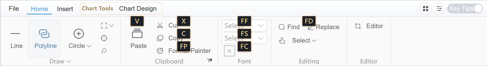

# ML Ribbon (Vue3 + Element Plus)

A Vue 3 + TypeScript Ribbon UI component library aligned with Syncfusion Ribbon concepts, implemented on top of Element Plus.



[Live Demo](https://mlightcad.github.io/ribbon/)

## What This Project Provides
- Ribbon container/state orchestration (`MlRibbon`)
- Tabs, groups, collections, and item host composition
- Advanced Ribbon-only items:
  - `MlRibbonGroupButton`
  - `MlRibbonGallery`
  - `MlRibbonTemplateItem`
- File menu and backstage shells
- Contextual tabs and key tips overlays
- Runtime dynamic API for tab/group/item mutations
- Size unification with Element Plus (`large/default/small`) via `MlRibbon` `size` prop or global `ElConfigProvider`
- Theme alignment with Element Plus light/dark mode (via `html.dark` class)
- Internationalization-ready UI text model via `MlRibbon` `texts` prop (no built-in hard-coded visible strings in Ribbon components)
- Icon-only command rendering via `RibbonItemModel.hideLabel`
- Group footer command popover via `RibbonGroupModel.footerMenuItems`
- Customizable tab-right extension area via `MlRibbon` `#tabs-extra` slot

## Naming Conventions
- Component names use `Ml` prefix.
- CSS classes use `ml-` prefix.

## Tech Stack
- Vue 3
- TypeScript
- Vite
- Element Plus
- Vitest + Vue Test Utils
- Playwright

## Quick Start
```bash
pnpm install
pnpm dev
```

Consumer projects need to install peer dependencies explicitly:

```bash
pnpm add vue element-plus @element-plus/icons-vue
```

## Component Usage

### 1. Import
```ts
import { MlRibbon } from './src/ribbon'
import type { RibbonTabModel } from './src/ribbon'
```

### 2. Basic Example
```vue
<script setup lang="ts">
import { ref } from 'vue'
import { MlRibbon } from './src/ribbon'
import type { RibbonLayout, RibbonTabModel } from './src/ribbon'

const activeTab = ref('home')
const layout = ref<RibbonLayout>('classic')
const minimized = ref(false)

const tabs = ref<RibbonTabModel[]>([
  {
    id: 'home',
    title: 'Home',
    groups: [
      {
        id: 'clipboard',
        title: 'Clipboard',
        collections: [
          {
            id: 'clipboard-actions',
            items: [
              { id: 'paste', type: 'button', label: 'Paste', size: 'large' },
              { id: 'copy', type: 'button', label: 'Copy', size: 'small' },
            ],
          },
        ],
      },
    ],
  },
])

function handleItemClick(payload: { tabId: string; groupId: string; itemId: string }) {
  console.log('Ribbon item clicked:', payload)
}
</script>

<template>
  <MlRibbon
    v-model:active-tab="activeTab"
    v-model:layout="layout"
    v-model:minimized="minimized"
    :tabs="tabs"
    @item-click="handleItemClick"
  />
</template>
```

### 3. Common Props
- `tabs: RibbonTabModel[]` Ribbon data source (required)
- `v-model:active-tab` active tab id
- `v-model:layout` ribbon layout (`classic` | `simplified`)
- `v-model:minimized` minimize state
- `size` uses Element Plus size (`large` | `default` | `small`)
- `hide-layout-switcher` whether to hide layout switcher, default `false`
- `hide-minimize-button` whether to hide minimize button, default `false`
- `hide-key-tips-toggle` whether to hide key tips toggle, default `false`
- `show-file-menu` whether to show file menu, default `true`
- `file-menu-items` file menu item list
- `backstage-items` backstage item list
- `texts` localized UI text overrides

### 4. Common Events
- `@tab-change="(tabId) => {}"` tab switched
- `@layout-change="(layout) => {}"` layout switched
- `@item-click="({ tabId, groupId, itemId }) => {}"` item clicked
- `@file-menu-select="(id) => {}"` file menu command selected
- `@overflow-open` / `@overflow-close`
- `@backstage-open` / `@backstage-close`

### 4.1 Tab-Right Custom Slot
Use `#tabs-extra` to render custom controls at the far-right side of the ribbon header (for example language switchers).

```vue
<MlRibbon :tabs="tabs">
  <template #tabs-extra="{ activeTab, layout, minimized }">
    <MyLanguageSwitcher />
  </template>
</MlRibbon>
```

### 5. Dynamic Runtime API (Component Ref)
`MlRibbon` exposes `RibbonDynamicApi` via `ref`, allowing runtime mutations:
- Tab operations: `addTab`, `removeTab`, `showTab`, `hideTab`, `selectTab`
- Group operations: `addGroup`, `removeGroup`, `showGroup`, `hideGroup`
- Item operations: `addItem`, `removeItem`, `updateItem`, `enableItem`, `disableItem`
- Layout operations: `refreshLayout`, `minimize`, `toggleSimplified`

## Scripts
```bash
pnpm dev
pnpm build
pnpm build:demo
pnpm test
pnpm test:watch
pnpm test:e2e
pnpm preview
```

- `pnpm build`: library build (`src/ribbon/index.ts`) with `vue` and `element-plus` externalized.
- `pnpm build:demo`: demo app build from `index.html`.

## Project Structure
```text
src/
  ribbon/
    components/    # MlRibbon core structure components
    items/         # advanced ribbon-only items
    modules/       # file menu/backstage/keytips/contextual tabs
    composables/   # state and runtime api logic
    styles/        # ml-prefixed styles
    index.ts       # public exports
docs/
  requirements.en.md
AGENTS.md
```

## Documentation
- English requirements document: `docs/requirements.en.md`
- Agent coding conventions: `AGENTS.md`

## Current Status
- V1 baseline is implemented and buildable.
- Core APIs and tests are available.
- Key tips now support `Alt` activation, sequence matching, and command dispatch via `itemClick`.
